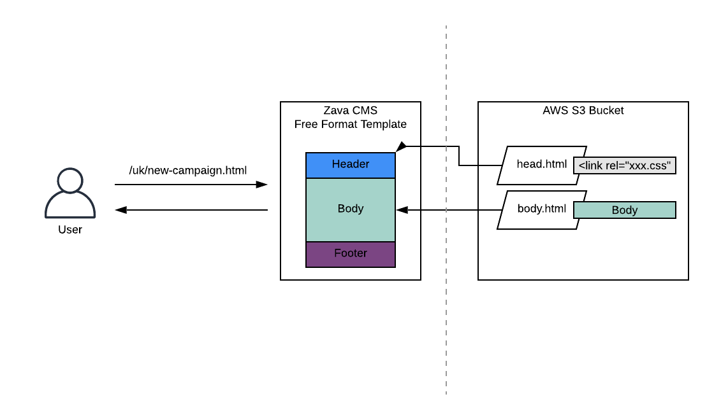
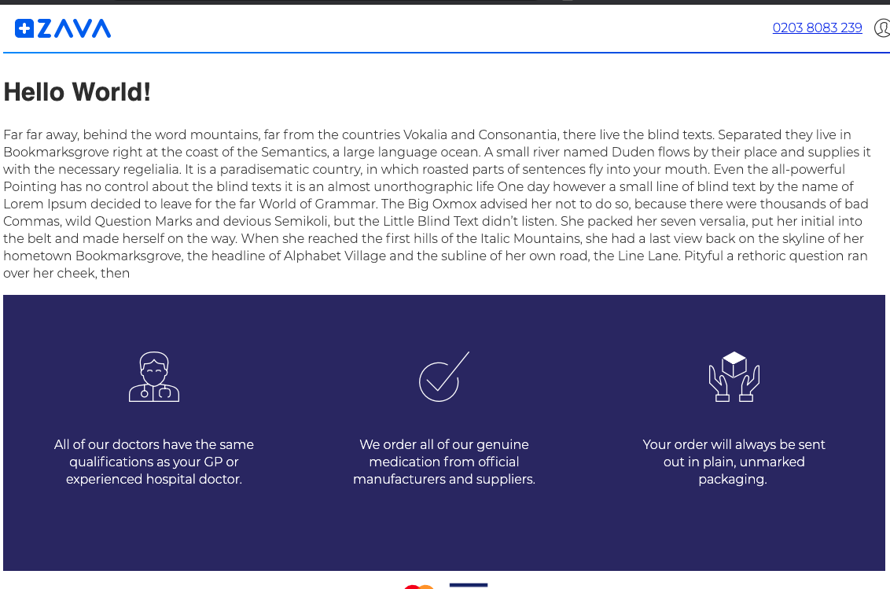
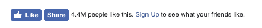
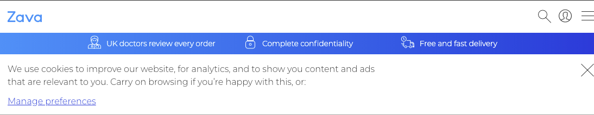

# Free Format Template Overview

Free Format template is a template that loads body and head parts from the S3 bucket.

* You can focus on your campaign part, not on the header, footer, tracking, analytics, cookie banner
* Zava styles are loaded by default

To release new page, you need to edit body.html and head.html according to your needs, add assets and then upload everything to S3 bucket.

This is a diagram that explains how it works:



| Name | Description |
| --- | --- |
| Zava CMS | This is our CMS that handles all the requests. Zava will create a new page with a specific URL (e.g. https://www.zavamed.com/uk/campaign-xxxxx.html) with some SEO and S3 bucket configuration.|
| Free Format Template | This is our template that loads the body part from the S3 bucket, and add all the default functionalities around it, for example, rendering a header and a footer. The page has configurations to point a head.html and a body.html on AWS S3 bucket.|
|AWS S3 Bucket|Zava setup an AWS S3 bucket and a folder (e.g. `campaign-xxxxx`) in order to provide a place to upload files for the campaign page (body.html, head.html, and assets).|
| body.html | This is a file that we’d like you to create for the body part. The html file will be injected into our template directly. |
|head.html|This is a file that we’d like you to create for the head part. This html file will be injected into our template’s `<head>` part directly in order to load some assets like CSS and JavaScript. You don’t have to add anything regarding SEO meta tag since our template automatically adds them from our page configuration.|


## Getting Started


For development, we recommend using example.php to load header and footer, and inject body.html and head.html. This would be much easier than uploading your files to S3 bucket to see the results that you’ve changed.

* example.php (local emulator)
* `campaign-xxxxx` folder:
    * body.html
    * head.html
    * `assets` folder for you campaign's assests (more further down) 

1. Clone this repository as a starting point.
2. Adjust the name of the of the `campaign-xxxx` folder and the references to it in `example.php` to the folder name for your campaign (most editors/IDEs should do the later automatically)    

Please keep in mind that `example.php` is just provided for ease of local testing. It tries to emulate some of the functionality we have server side. The real environment will actually **not** execute any php code.

### Run using Docker

If you know how to use Docker, the easiest way to start is that going to the folder on terminal, and run the command below:

```bash
# Run: 
prompt$ docker run -d -p 8080:80 -v "$PWD":/var/www/html php:7.2-apache

# Use your browser to go to: 
# http://localhost:8080/example.php

```

### Run in your own php Environment

Place these files under your PHP environment and hit example.php (e.g. http://localhost:8080/example.php) and you will see a header, ‘Hello World’ text, and a footer.



## Development details

### body.html

This file will be injected into immediately after our `<header>` tag and before `<footer>` tag. All the campaign content has to be inside of this file. You don’t have to add header and footer since our CMS automatically add them. However, please make sure your code doesn’t break our header and footer, particularly when you write extra CSS.

Example body.html:
```html
<p>Hello World</p>


```

### head.html

This file will be injected into at the end of the page’s `<head>` tag directly. You may need to add some CSS or fonts in this section. Even if you don’t need the file, please just upload an empty file.

Example head.html:
```html
<link rel="stylesheet" href="https://fractl.zavamed.com/campaign-xxxxx/campaign-specific.css">
```
### Default Assets

The templates loads some default assets for Zava styling, mainly for a header, a footer and a cookie banner.

### Your Own Assets (images, JS/CSS/font files)

All the files have to be uploaded into the S3 bucket even if it’s in the development mode. All the attributes for the URLs have to be a full URL includes a domain, fractl.zavamed.com. Otherwise, it wouldn’t work under the production domain(www.zavamed.com).

Example:
When you need to add a new image to your `body.html`, you have to upload the file into S3 bucket first, and add an img tag with a src attribute **includes the domain and folder name**.
```html
<p>Hello World</p>


```

### CORS - Domain Restrictions

On our CMS, we **don’t allow to make external requests**. If that’s JavaScript libraries like jQuery, please upload the file into the S3 bucket instead of using the URL from CDN (e.g. https://code.jquery.com/jquery-3.4.1.min.js). These two domains are currently we allow to use from our system.

* www.zavamed.com
* fractl.zavamed.com

If you really need to make requests outside of our domain, **please consult us in advance**.

The `example.php` tries to replicate that behaviour by setting up some security and CORS headers.

### Cookies & Social Sharing Buttons

Please **don’t set or get cookies(particularly, extra ones) through JavaScript** since all the cookies are handled by our cookie-consent manager.

This rule will be applied to ‘Share’ buttons for social networking websites as well. Twitter, Facebook and Instagram have buttons that make requests to their servers for showing number of ‘Like’. However, since we don’t allow to set cookies neither allow to making requests, please implement a link button like below.

Buttons that you can’t use:



Buttons that you can use:


Example (the styles are all included by default):
```html
<a title="Twitter Sharer" href="<!-- Twitter sharing url -->" target="_blank" rel="noopener noreferrer" aria-label="Twitter">
   <div aria-hidden="true">
      <i class="Icon Icon-twitter Icon--24"></i>
   </div>
</a>
```

### Supported Browsers

* Google Chrome 51+
* Mobile Chrome 51+
* Samsung Internet Browser 5.4+
* Safari 10+
* Mobile Safari 9+
* Internet Explorer 11+
* Microsoft Edge 14+
* Mozilla Firefox 52+

### Uploading HTML files on S3 Bucket

Zava will create a S3 bucket and the folder for you to upload all the files. When you upload the file, please make sure the file names are ‘body.html` and ‘head.html’ for each, and these files are publicly accessible. The location of these files have to be under the folder.

For example, if the folder name was `campaign-xxxxx`, you’ll have to upload

* `campaign-xxxxx/head.html`
* `campaign-xxxxx/body.html`

You will be able to access the page with `https://www.zavamed.com/uk/campaign-xxxxx.html`. The URL will be accessible through our CMS directly, however, it will not be shown up anywhere on other pages neither `sitemap.xml` until our marketing team changes the configuration.

For assets(images, JS/CSS files, fonts, etc), you can upload the files the same way and you can also create folders if you need. The difference is that to access the assets from your HTML, the URL has to be full URL includes domain `fractl.zavamed.com`.

## Default Functionalities

### SEO

We automatically include some meta tags automatically to our <head> based on our page configuration. That means you wouldn’t have to add something specifically on <head> to set canonical URL, etc.

### Cookie banner

Our template loads cookie banner automatically for tracking users. That means you don’t have to implement the banner by yourself, and please make sure your JavaScript code doesn’t break the functionality particularly if you need to use ‘absolute’ or ‘sticky’ position.



### Tracking / Analytics
As soon as users clicked ‘Accept’ button on the cookie banner, we load JavaScript for some tracking and analytics. All the `<a>` tags on the page will be automatically handled by our library to send events to our system.

**Unless we specified sending events, please don’t change events or create new ones.**
